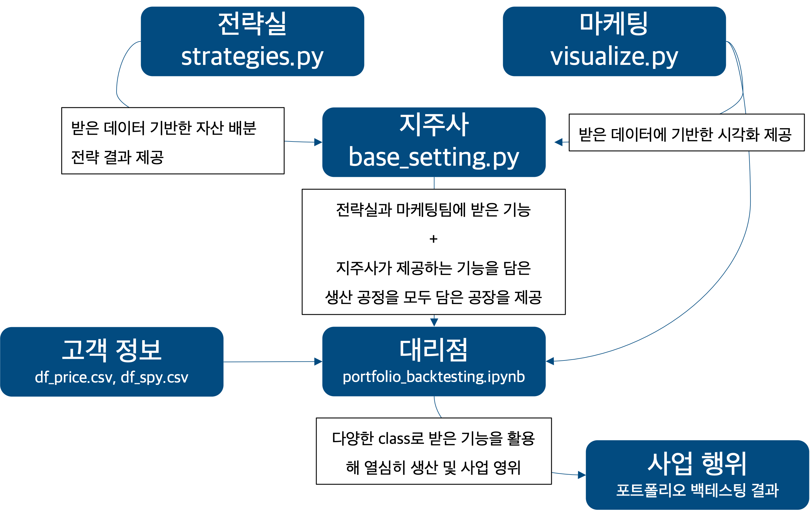

**Other languages**: [한국어](README.ko.md)

# Portfolio Backtesting Project

## Description
This project is a comprehensive backtesting framework designed to evaluate various portfolio strategies using historical data. It includes modules for preprocessing data, defining strategies, calculating performance metrics, and visualizing results.

### Project Context
- **Scope**: This project is a focused component of a larger endeavor to build an Algorithm Trading System Structure. It aims to test the viability of specific trading strategies under simulated conditions.
- **Inspiration**: The main idea for the structure came from [this blog post](https://brunch.co.kr/@quantdaddy/203).
- **Development Approach**: Building the entire system at once was daunting; hence, the decision was made to first develop the backtesting part with limited functions and data.
- **Ongoing Development**: This codebase will be continuously updated to enhance functionality and extend coverage.
- **Object-Oriented Approach**: The project utilizes OOP principles, structuring the code around classes to better manage complexity and ensure modularity.
- **Initial Steps**: This repository represents the initial phase in the development of a comprehensive algorithmic trading system.

## Features
- **Data Preprocessing**: Load and preprocess financial data.
- **Strategies Definition**: Implement various investment strategies focusing on momentum and volatility.
- **Performance Calculation**: Evaluate strategies using metrics like CAGR, Maximum Drawdown, and Sharpe Ratio.
- **Visualization**: Graphically represent strategy performance and comparisons.

## Usage


### Running the Backtest
To run the backtest, execute the `portfolio_backtesting.ipynb` notebook:
```bash
jupyter notebook portfolio_backtesting.ipynb
```
Follow the instructions within the notebook to select your strategies, set parameters, and run the simulations.

### Modules relation


### Modules Overview
- `base_setting.py`: Configures the backtesting environment, including initial investment setup and data indexing.
- `performance.py`: Contains functions to calculate key performance indicators such as CAGR, MDD, and Sharpe Ratio.
- `strategies.py`: Defines different investment strategies based on momentum and volatility adjustments.
- `tool_kits.py`, `visualize.py`, `visualize_v2.py`, `visualize_v3.py`: Provide various utilities and visualization tools for analyzing backtesting results.

## Authors
- seongyun, cho

- ### Prerequisites
- Python 3.x
- Pandas
- Numpy
- Matplotlib

To get started, clone this repository to your local machine using:
```bash
git clone https://github.com/your-username/portfolio-backtesting.git
```

### Setup
Install the required Python packages:
```bash
pip install -r requirements.txt
```
